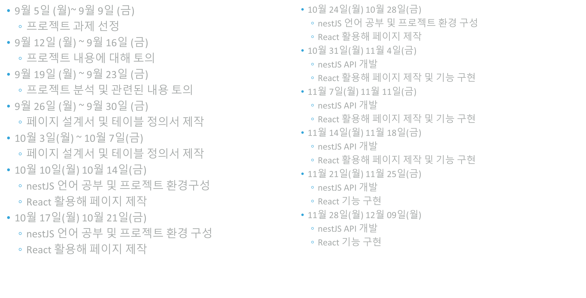
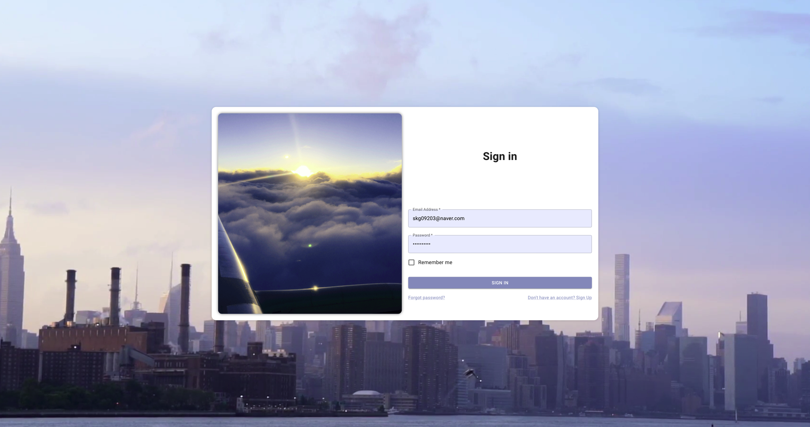

# SODI
> Full Name: Let's *S*hare **O**ur **D**aily l**I**ves

> ※추 후 개인서버에 배포하여 포트폴리오 목적으로, 사용이 가능하도록 만들예정이다.

# 계기
대학교에서 각자 한 가지의 주제를 정해 원하는걸 만들라는 과제가 있었다.  
나는 웹사이트를 만들기로 결정하였고, 고민끝에 커뮤니케이션 관련 웹사이트를 만들기로 하였다.  
큰 틀은 국제 커뮤니케이션이고, 자신이 갔던 곳에 위치를 바로 바로 저장하고, 다른 사용자들과 정보를 공유 및,  
소통하는것을 주제로 삼았다.  
발표 당시 사람들에게 좀 더 높은 점수를 받지 않을까 하는 생각으로 지도 관련 기능을 메인으로 삼았다.  

> 추가로 React복습과, NestJS, Typescript를 공부하고 싶은 마음에, DB를 제외한 나머지 언어는 거의 처음 쓰는걸로 사용하였다.

---

# 기술스택

## Front-end
 - HTML
 - CSS ( SCSS )
 - Javascript
   - React : 싱글 페이지 애플리케이션의 UI를 만드는데 초점을 둔 라이브러리 ( UI Javascript 라이브러리 ) 
   - Material UI (MUI) : 기존 Material 디자인을 리액트에서 쉽게 사용할 수 있도록 해주는 UI 프레임워크
   
## Back-end
 - NestJS : Node.js 기반의 서버 프레임워크로, Typescript를 기본으로 사용하며, Spring MVC형태와 비슷하게 작성할 수 있다.
 - Database
   - MariaDB ( MySQL )
 - Testing Tool
   - Swagger

## API
 - MapBox : 지도 API로 ( 지도 디자인(바다, 건축물 ,도로 등 )을 커스텀할 수 있고, 자체 검색데이터, 부가적인 기능 등이 존재한다. )
 - lookup : 설계 당시에 lookup API를 사용해, 접속한 유저의 ip를 기준으로 국가를 구분하고, 그에 맞춰 회원가입 및 컨텐츠 제작을
하려고 했으나, 시간 관계상 넣지 않기로 했다.

---
 
# 테이블 설계
 - user -> 권한을 부여하여, 관리자 / 유저층으로 나눌 생각이였지만, 생각보다 적은 시간으로 인해 유저 권한만 사용하기로 하였다.
 - board -> 처음에는 게시글 컬럼에 image1, image2 형식으로 컬럼을 여러개 하려 했으나, 관리할 때 어렵다고 판단하여,
   이미지 이름이 담긴 배열을 문자열 형태로 보관하기로 결정하였다.
 - comment -> 대댓글이 가능하도록 구현했고, 불러올 때 'comment_order', 'comment_group_num', 
   'group_class'를 정렬하여 대댓글이 잘 보이도록 구현하였다.

---

# 업무 진행 일정표

학교에서 지정해준 과제 기간은 총 3개월이다.
초반에 정한 업무 진행 일정표는 위와 같다. 
사용할 언어를 선정하고, 공부를 하고, 만들면서, 페이지 설계서를 작성할 예정이였으나,
만들면서 생겨나는 에러 + 디자인 문제로 페이지 설계서 작성은 안하기로 했다.

# 과제물 시연 결과

## 로그인 페이지

 - 시각적 요소를 높이기 위해, 뒷 배경은 영상을, 로그인 컴포넌트 좌측의 작은 사진은 gif형태로 만들었다.
 - 아이디와, 비밀번호를 입력하여 로그인이 가능하다.
 - 메인페이지에서 사용하는 페이지, 기능들에는 유저 정보가 필요하여, 로그인을 강제하도록 했다.

## 회원가입 페이지

