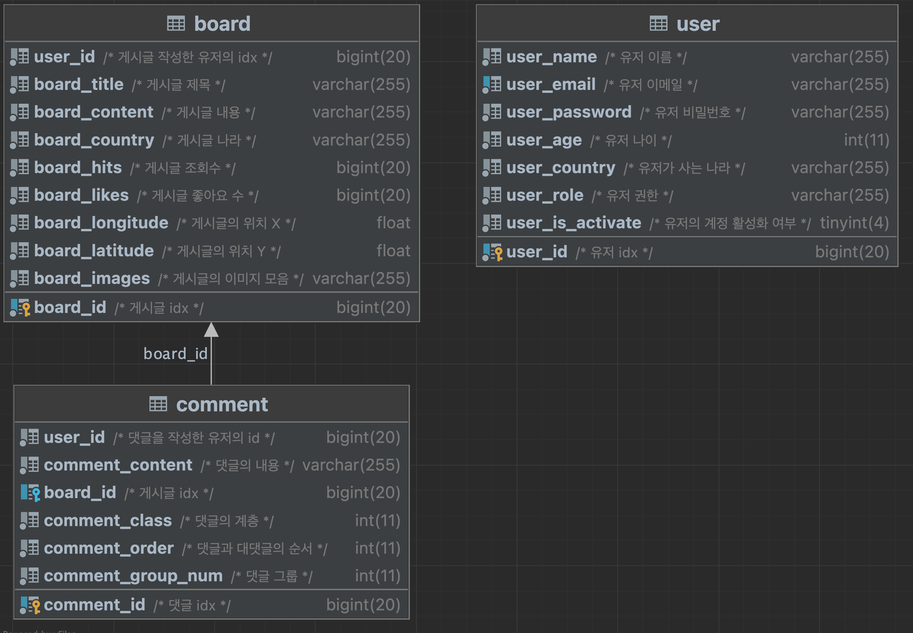

# SODI
> Full Name: Let's *S*hare **O**ur **D**aily l**I**ves

## 계기
대학교에서 각자 한 가지의 주제를 정해 원하는걸 만들라는 과제가 있었다.  
나는 웹사이트를 만들기로 결정하였고, 고민끝에 커뮤니케이션 관련 웹사이트를 만들기로 하였다.  
큰 틀은 국제 커뮤니케이션이고, 자신이 갔던 곳에 위치를 바로 바로 저장하고, 다른 사용자들과 정보를 공유 및,  
소통하는것을 주제로 삼았다.  
발표 당시 사람들에게 좀 더 높은 점수를 받지 않을까 하는 생각으로 지도 관련 기능을 메인으로 삼았다.  

> 추가로 React복습과, NestJS, Typescript를 공부하고 싶은 마음에, DB를 제외한 나머지 언어는 거의 처음 쓰는걸로 사용하였다.

---

## 기술스택

### Front-end
 - HTML
 - CSS ( SCSS )
 - Javascript
   - React : 싱글 페이지 애플리케이션의 UI를 만드는데 초점을 둔 라이브러리 ( UI Javascript 라이브러리 ) 
   - Material UI (MUI) : 기존 Material 디자인을 리액트에서 쉽게 사용할 수 있도록 해주는 UI 프레임워크
   
### Back-end
 - NestJS : Node.js 기반의 서버 프레임워크로, Typescript를 기본으로 사용하며, Spring MVC형태와 비슷하게 작성할 수 있따.
 - Database
   - MariaDB ( MySQL )
 - Testing Tool
   - Swagger

### API
 - MapBox : 지도 API로 ( 지도 디자인(바다, 건축물 ,도로 등 )을 커스텀할 수 있고, 자체 검색데이터, 부가적인 기능 등이 존재한다. )
 - lookup : 설계 당시에 lookup API를 사용해, 접속한 유저의 ip를 기준으로 국가를 구분하고, 그에 맞춰 회원가입 및 컨텐츠 제작을
하려고 했으나, 시간 관계상 넣지 않기로 했다.

